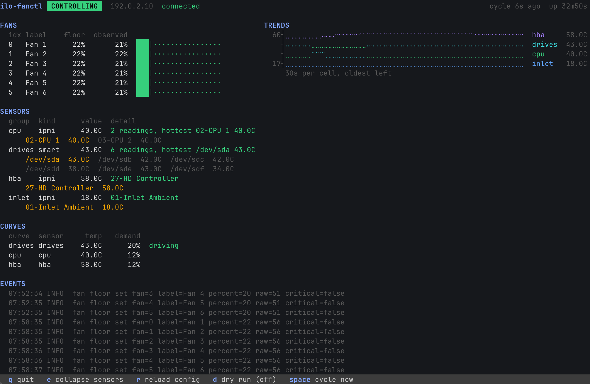

# ilo-fanctl

A Linux fan control daemon for HPE ProLiant servers. It drives iLO 4 fan floors
from host-side drive and sensor temperatures, so disks and a storage controller
get the airflow the BMC will not give them on its own.

It raises minimum fan speeds and never caps them. iLO's own thermal curve keeps
running underneath, free to spin the fans faster than any floor set here, so a
bad curve or a stuck sensor can make the machine loud but cannot make it hot.

Verified on a ProLiant DL380 Gen9, iLO 4 firmware 2.77, Smart HBA H240ar in HBA
mode.



## Why: iLO's 08-HD Max sensor under-reports drive temperature

iLO's `08-HD Max` sensor claims to report the hottest drive. It does not.
Measured against per-drive SMART on the reference machine:

| Source | Reading |
| --- | --- |
| `08-HD Max` via IPMI | 44 to 46 C |
| Hottest SAS drive via SMART | 56 C |
| Coolest SAS drive via SMART | 45 C |

It tracks the coolest drive and reads 10 to 12 C low. Its only threshold is
Upper Critical at 60 C, with no upper non-critical step and no way to change
either, so the BMC first reacts at roughly 70 C of real drive temperature.
Meanwhile the fans idle at 9 to 11 percent.

Everything else the BMC measures is accurate, so this reads drives from SMART,
everything else from IPMI, and only adjusts the floor.

## Requirements

- Firmware patched with [ilo4_unlock](https://github.com/kendallgoto/ilo4_unlock).
  Stock firmware has no `fan` command and this tool cannot do anything at all.
  **An HPE firmware upgrade silently reverts the patch.** See Detecting a
  reverted ilo4_unlock patch below.
- `smartctl` and `ipmitool` on the host.
- Go 1.26 or later to build.

It must run on the machine that physically owns the drives and `/dev/ipmi0`. On
a virtualised host that is the hypervisor, not a guest: the reference machine
runs it on the Proxmox host, not in a VM.

## Install

A package carries the binary, the systemd unit and the example config, and
pulls in `smartmontools` and `ipmitool`. It starts nothing: there is no config
yet, and a thermal daemon without one is a restart loop. An upgrade restarts
the service only if it was already running.

```sh
VER=0.1.1   # or whatever the latest release is

# Debian, Ubuntu, Proxmox
curl -fsSLO https://github.com/alekc/ilo-fanctl/releases/download/v${VER}/ilo-fanctl_${VER}_linux_amd64.deb
apt install ./ilo-fanctl_${VER}_linux_amd64.deb

# RHEL, Rocky, Alma, Fedora
dnf install https://github.com/alekc/ilo-fanctl/releases/download/v${VER}/ilo-fanctl_${VER}_linux_amd64.rpm
```

Anywhere else, take a static binary (`ilo-fanctl-linux-amd64` or `-arm64`,
with `SHA256SUMS`, on the releases page) or build it, then install the unit
from `systemd/` by hand. `go install github.com/alekc/ilo-fanctl/cmd/ilo-fanctl@latest`
works too and stamps the tag it built. None of those create `/etc/ilo-fanctl`
or put the example config in it the way the packages do, so:

```sh
VER=0.1.1   # the release you just installed, so the example matches the binary

install -d -m 0750 /etc/ilo-fanctl   # 0750: the BMC private key lives here
curl -fsSL -o /etc/ilo-fanctl/config.example.yaml \
  https://raw.githubusercontent.com/alekc/ilo-fanctl/v${VER}/config.example.yaml
```

Then, however it got there:

```sh
cp /etc/ilo-fanctl/config.example.yaml /etc/ilo-fanctl/config.yaml
# edit it, and put a key the BMC accepts where ilo.key_path points
ilo-fanctl -config /etc/ilo-fanctl/config.yaml -check
systemctl enable --now ilo-fanctl
```

The shipped unit runs `/usr/bin/ilo-fanctl`, because a package may not install
into `/usr/local`. To point it at a hand-built binary somewhere else, use a
drop-in (`systemctl edit ilo-fanctl`) with an empty `ExecStart=` before the
replacement, rather than editing the unit file a package upgrade will replace.

### Command line

| | |
| --- | --- |
| `ilo-fanctl` | Run the control loop as a daemon. What the unit runs. |
| `ilo-fanctl tui` | Foreground, with the live display. Takes the control loop if nothing else holds `listen`, otherwise attaches read only. |
| `-config PATH` | Default `/etc/ilo-fanctl/config.yaml`. |
| `-check` | Validate the config and exit. Writes nothing, connects to nothing. |
| `-dry-run` | Collect, evaluate, log and read back as normal, but never write a floor. |
| `-view` | `tui` only: attach read only even when the control loop is free. |
| `-log-level` | `debug`, `info`, `warn` or `error`. Default `info`. |
| `-version` | Print the version and exit. |

### Service lifecycle

```sh
systemctl status ilo-fanctl
systemctl reload ilo-fanctl    # re-read the config now rather than on the next poll
journalctl -u ilo-fanctl -f
```

Stopping is not neutral: on `SIGTERM` the daemon winds every fan it manages back
down to `min_floor_pct`, handing the machine to iLO's own curve rather than
leaving it pinned at the last floor written. That is one SSH round trip per fan
against a deliberately slow shell, which is what `TimeoutStopSec=45` is sized
for. A `SIGKILL` skips it and the last floor stays in force until the BMC is
reset.

`Restart=always` with no start rate limit, because a BMC that has gone away
comes back, and the default limit would turn a few quick failures into a unit
that stays dead until someone resets it by hand.

The unit runs under `ProtectSystem=strict` and `ProtectHome=yes`, which assumes
the BMC key is at `/etc/ilo-fanctl/id_rsa`. A key under `/root` or a home
directory is unreadable to the service and fails as an authentication error,
which does not point at its own cause.

## BMC access: the iLO user and SSH key

Create a dedicated iLO user with **every privilege unchecked**. It cannot power
the machine, mount media, or change settings. The fan commands the patch adds
are not privilege-checked, which is what makes an account this weak sufficient.

iLO 4 will not accept an ed25519 key, so generate RSA and load the public half
through the iLO web UI, or over its own CLI with `oemhp_loadSSHKey`:

```sh
ssh-keygen -t rsa -b 2048 -m PEM -f /etc/ilo-fanctl/id_rsa -C ilofanuser
chmod 0600 /etc/ilo-fanctl/id_rsa
```

Pin the BMC's host key while you are there with `ssh-keyscan -t rsa
<bmc-address>`. Leaving `ilo.host_key` empty is allowed and logged as a warning
at every startup.

## Configuration

[config.example.yaml](config.example.yaml) is fully commented and is the
reference. In short: `sensors` are named groups of SMART or IPMI readings,
`fans` are zero-based iLO fan indexes grouped into zones, `curves` map one
sensor group onto a demanded floor for its zones, and `safety` bounds all of
it. Where several curves cover the same fan, the highest demand wins.

Everything is validated at startup and the process refuses to run on a config
it cannot fully make sense of, so a typo is a startup error rather than a
runtime surprise. `-check` validates a file without connecting to anything.

**[Full configuration reference](docs/configuration.md)**, including hot
reload.

## Foreground display (TUI)

`ilo-fanctl tui` runs in the terminal with the live view shown at the top of
this page: fans, sensor groups, curves and a scrolling event log, with a trends
chart alongside. The two panes worth explaining, as text:

```
FANS                                              TRENDS
  idx label            floor  observed              67┤⠉⠉⠉⠑⠒⠒⠊⠉⠉⠉⠉⠉⠉⠉⠉  hba     67.0C
  0   cpu1-front         20%       24%  ████|···      ┤⣀⣀⣀⣀⣀⣀⣀⡠⠤⠤⠤⠤⠤⠤⠤  cpu     61.0C
  1   cpu2-front         20%       20%  ███|····      ┤⣀⣀⡠⠤⠤⠔⠒⠒⠒⠒⠢⠤⠔⠒⠒  drives  52.0C
                                                    21┤⣀⣀⣀⣀⣀⣀⣀⣀⣀⣀⣀⣀⣀⣀⣀  inlet   21.0C
                                                       30s per cell, oldest left
```

The bar is the observed speed and the `|` marks the commanded floor. A fan above
its marker is iLO's own curve doing its job; a fan below it is the failure this
program exists to detect, and is called out in red.

`e` expands the sensor groups to list every reading. The group row reports a
max, and a max hides its inputs: five drives at 40C with one at 54C reads the
same as six at 54C until you expand it.

The trends pane appears from 104 columns. Every group is a line on one shared
temperature axis, one cell per completed cycle, oldest on the left, capped at
sixty cells: half an hour at the default interval. One axis rather than one per
group, so height means the same thing everywhere and a group that has not moved
is a flat line instead of noise magnified to fill a range of its own. The axis
spans the coldest to the hottest reading in the window, never narrower than five
degrees. Lines are drawn in braille, the only way to put a thin line at an
arbitrary height in a character grid. A blank cell is a cycle the group could
not be read, never an interpolation across it, and history is in memory only.

A terminal cell has one foreground colour and colour is all that tells the lines
apart, so where two groups would share a cell the colder one is pushed down a
row. The order between them stays true and each keeps its shape, but the gap is
drawn wider than it is: read the numbers, not the spacing.

**It decides for itself whether it is allowed to drive anything.** On startup it
tries to bind `listen`. If it binds, nothing else is running and this process
takes the control loop. If not, a daemon already owns the loop, so the TUI
attaches to that daemon's `/metrics` and shows a read-only view marked `VIEWING`
with the control keys disabled. The listen socket is the mutual exclusion, so
two writers can never end up fighting over the same BMC. Force the read-only
path with `-view`. Running the TUI alongside the service is the intended way to
watch it.

In read-only mode the numbers come from the exporter and the labels from the
config file on disk. If the daemon is running a different config, the header
says so rather than presenting the mixture as one coherent picture.

Quitting with `q` winds the fans down to `min_floor_pct` exactly as a `SIGTERM`
would, and prints the wind-down once the display has given the terminal back.

## Observability

Prometheus exposition on `listen`, default `127.0.0.1:9873/metrics`, covering
every sensor, curve demand, commanded floor and observed speed, plus loop
health. A gauge here never holds a value that was not measured: when a group
goes unreadable its series are removed rather than frozen.

The one alert to have is `ilo_fanctl_control_effective == 0`, which is how an
otherwise silent reverted firmware patch surfaces.

**[Metrics, alerts and logs](docs/observability.md)**.

## Safety

What this tool will never do, by construction:

- **Set a fan maximum.** `fan p N max` caps a fan and can starve the machine of
  cooling. Upstream attributes a fans-to-100-percent thermal shutdown partly to
  one left applied for hours. There is no config field for it, no code path
  reaches it, and a test fails if a maximum-shaped key is ever added.
- **Command a fan that is not in the config.** Commands to absent bays are the
  other half of that same upstream incident.
- **Report a write as successful because the write returned.** Every fan command
  on this firmware prints nothing at all, on success and on failure alike, so
  success is only ever established by reading the speeds back.

The floor is also bounded above by `safety.max_floor_pct`, which limits how loud
a runaway curve can make the machine. It is not a cap on fan speed: the BMC can
still go to 100 percent whenever it decides to.

Use `-dry-run` to collect, evaluate and log every decision without writing
anything; `d` toggles it in the display. Turning it on does not undo floors
already applied, it only stops new ones being sent.

## Detecting a reverted ilo4_unlock patch

An HPE firmware upgrade removes the `fan` command. Because the command is silent
either way, the writes keep appearing to succeed and simply stop having an
effect, which is how a machine goes from regulated to unregulated with nothing
in the logs.

The read-back is what makes that visible. When a commanded floor is not
reflected in the BMC's reported speed, `ilo_fanctl_control_effective` drops to
0, `ilo_fanctl_readback_mismatch_total` increments, the error log names the fan,
and the display turns it red.

**A floor is only judged after it has had a full interval to take effect.** The
read-back runs a few hundred milliseconds after the write, and a fan commanded
from 12 to 26 percent is still spooling up at that point, so judging it against
the floor just written reports every raise as a reverted patch. Each cycle is
judged against the floor that was already in place when it started, or the
current one where that is lower, so a floor removed mid-flight is still caught
immediately. `ilo_fanctl_control_effective` starts at NaN for the same reason: 0
from the moment the process starts is the alarm itself, and NaN compares false
against both `== 0` and `== 1`, so neither alert fires while the answer is
honestly unknown.

This was a real false positive, not a hypothetical: the first live run on a
DL380 Gen9 logged six mismatch errors on startup and drove `control_effective`
to 0 while independent `ipmitool` polling confirmed the floors had landed.

## Notes on the hardware

- Fan indexes are zero-based for `fan p`, one-based in the CLP. Index 0 is
  `/system1/fan1`, labelled "Fan 1".
- The PWM scale is 0 to 255 and linear: raw 51 reads back as exactly 20 percent.
- `fan pid N lo V`, which appears in several tutorials, does nothing on Gen9.
  `fan p N min V` is the command that works.
- iLO 4's SSH server drops commands sent back to back, so writes are paced 350
  ms apart. Everything else in a cycle is concurrent around that: sensor groups
  are collected in parallel, one `smartctl` per drive at a time, with the BMC
  handshake running alongside.
- iLO 4 speaks SHA-1 era key exchange and host keys that OpenSSH 9 and later
  disable by default, which is why the algorithm lists are configurable.
- One SSH session is opened and kept for the life of the process. Connecting is
  a no-op when one is already established, which is what lets a cycle start the
  handshake alongside its sensor sweep and join it only when it needs the BMC.
  Because of that no-op, any failed command closes the session: nothing else
  would ever rebuild it, so one BMC reset would otherwise leave the daemon
  writing into a closed pipe for as long as it runs. A cancelled command drops
  the session too, since its answer is still in flight and would be read as the
  next command's reply.
- The BMC has no way to report its factory per-fan minimum, so a floor once set
  cannot be un-set, only lowered. `reset /map1` on the BMC clears them.

## Licence

MIT. See [LICENSE](LICENSE).
